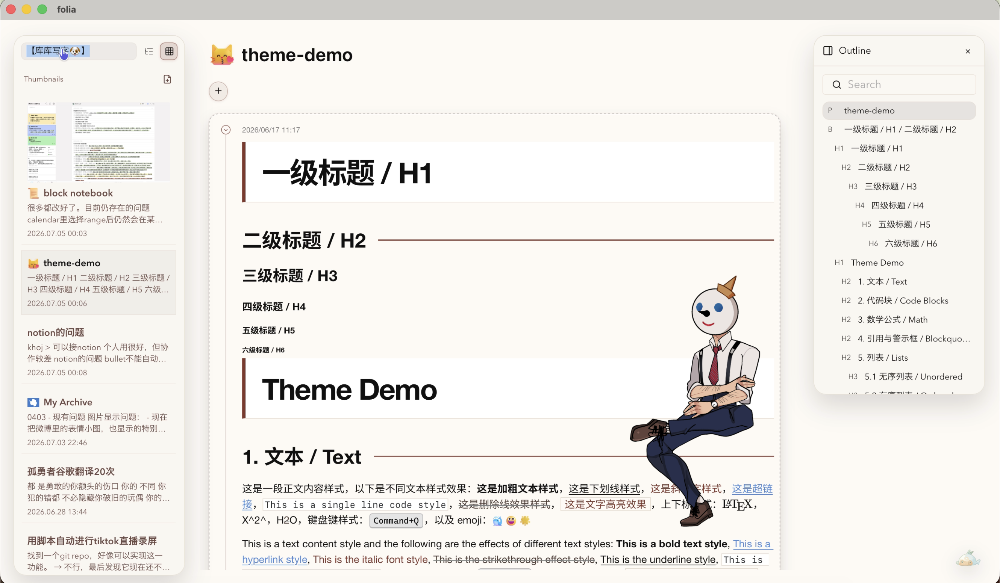

# folia

[中文介绍与开发说明](README.zh-CN.md) · [English overview and development](README.en.md) · [使用说明 / User guide](docs/USER_GUIDE.md)

folia 是一个本地优先的块状笔记应用，基于 Tauri、React 和 TipTap。支持嵌套页面、混合列表、终端富文本、桌面卡片与 macOS 小组件，并将外壳和正文主题分开设置。

folia is a local-first, block-based notebook built with Tauri, React, and TipTap, with nested pages, mixed lists, styled terminal snippets, desktop cards, and macOS widgets. Shell and content themes are configured separately.

视频展示较早版本；当前操作以随应用提供的[使用说明](docs/USER_GUIDE.md)为准。The video shows an earlier version; the bundled guide describes current behavior.

## 当前功能 / Current features

- 推荐外壳 / Recommended shells: **Tilted Paper**（留白与倾斜纸框 / airy, tilted paper）和 **Paper Collage**（亚麻与纸张拼贴 / linen and paper collage）。
- 基础选择 / Other shells: Typora Base（基础商务风 / minimal business style）、Garden Typora（基础布局的轻度变化 / a modest layout variation）及 Native Garden。
- 小鱼 → 外观调整：独立切换主题、设置背景 URL 或本地图片，双击编辑纸张题字。Fish → Appearance: theme selection, URL/local backgrounds, and editable captions.
- 同一缩进树混用待办、编号和普通列表 / Mixed task, ordered, and bullet lists.
- iTerm2 普通粘贴或保留颜色粘贴，并可继续编辑 / Normal or styled iTerm2 paste with editable text and formatting.
- SQLite 本地笔记、Markdown 导入导出、JSON 备份、页面历史和回收站 / Local SQLite notes, Markdown import/export, JSON backup, history, and trash.
- 桌面浮窗与 macOS 只读小组件 / Floating editor windows and read-only macOS widgets.

## 文档 / Documentation

- [完整使用说明与快捷键（中文）](docs/USER_GUIDE.md)
- [终端片段保存格式与兼容性](docs/terminal-paste.md)
- [默认素材与构建资产](docs/theme-assets.md)
- [开发、打包及发布（中文）](README.zh-CN.md#开发与打包) / [Development and packaging](README.en.md#development-and-packaging)
- [演示数据库切换](docs/demo-database.md)

源码推送不会自动发布安装包。当前主要支持 macOS；WidgetKit 小组件需要桌面版及包含扩展的安装包。Pushing source does not publish an installer; WidgetKit requires the macOS desktop bundle with its extension embedded.
