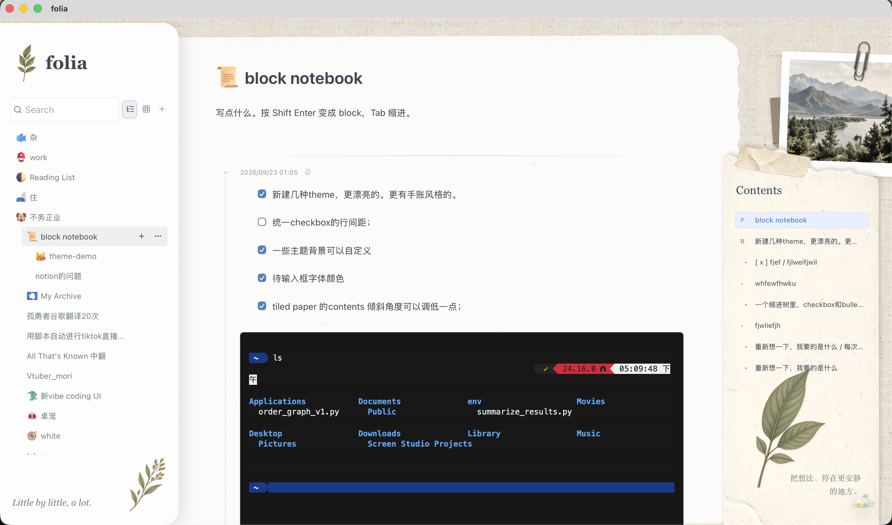
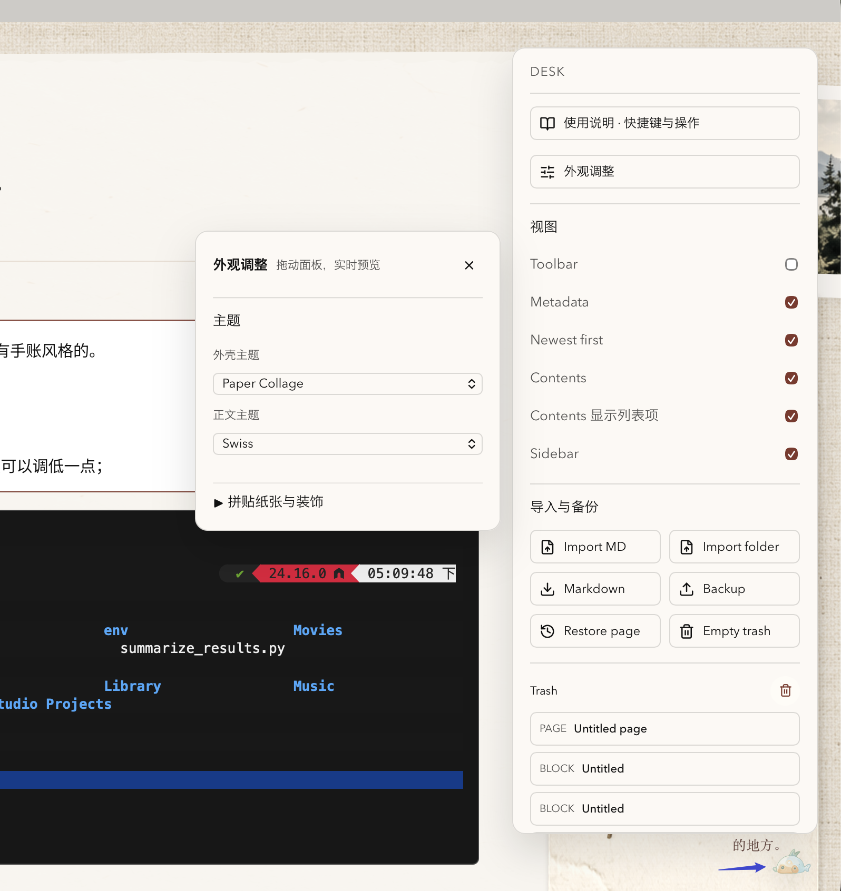
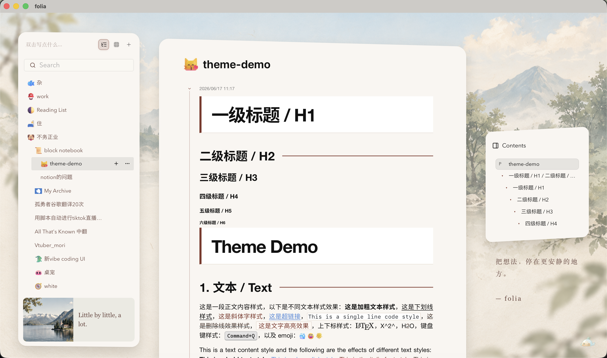
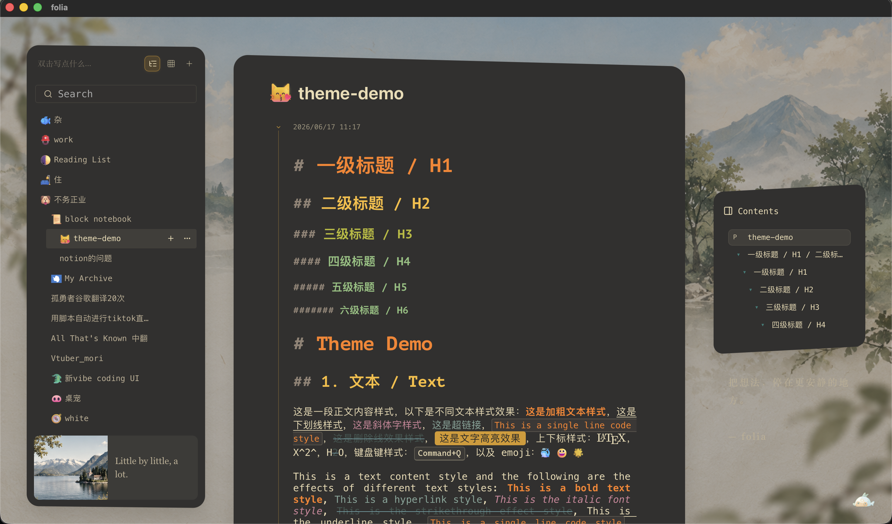
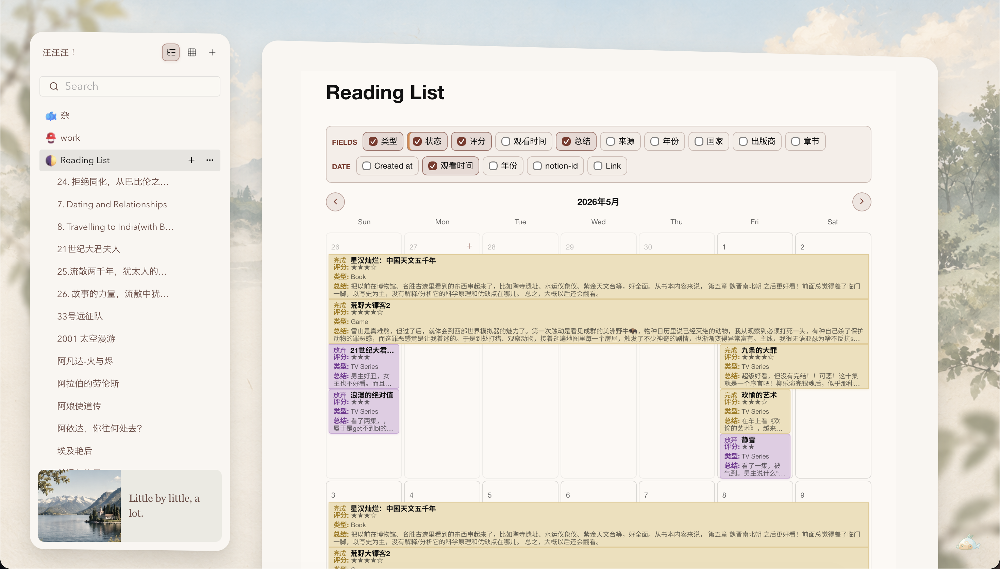

 

# folia

[中文介绍与开发说明](README.zh-CN.md) · [English overview and development](README.en.md) · [使用说明 / User guide](docs/USER_GUIDE.md)

folia 是一个本地优先的块状笔记应用，基于 Tauri、React 和 TipTap。支持嵌套页面、混合列表、终端富文本、桌面卡片与 macOS 小组件，并将外壳和正文主题分开设置。

folia is a local-first, block-based notebook built with Tauri, React, and TipTap, with nested pages, mixed lists, styled terminal snippets, desktop cards, and macOS widgets. Shell and content themes are configured separately.

## 你的工作区 / Your workspace

folia 的界面分成三块：左边整理 Notebook 和页面，中间写作，右边查看 Contents。左右栏可以用 `Cmd/Ctrl + [` 和 `Cmd/Ctrl + ]` 随时隐藏或重新打开；页面层级用 `Tab` 和 `Shift+Tab` 调整。



这张图里，左栏放 Notebook 和页面树，中间是正在编辑的页面，右侧 Contents 显示当前页面的结构。左栏搜索可以同时查找页面标题和正文内容。

## 开始使用 / Get started

打开 folia 后：

1. 在左侧选择或新建一个 Notebook。
2. 按 `Ctrl/Cmd+N` 新建页面。
3. 在正文中输入文字，按 `Shift+Enter` 保存为一个 block。
4. 双击页面标题重命名；点击 block 日期，将它固定到 Pinned。
5. 点击左下角的小鱼，切换主题、背景和装饰。

最常用的输入语法：

```text
**粗体**       ==高亮==       `行内代码`       ~~删除线~~
- 无序列表    1. 编号列表    [] 待办列表       > 引用
/at 添加附件  /math 添加 LaTeX 公式  /table 添加表格  /link 链接到其他页面
$2^3$ 行内公式
```

输入三个反引号可以插入代码块；带语言名的代码块可以折叠。终端用户还可以用 `Cmd/Ctrl+Option+C` 从 iTerm2 复制内容，用 `Cmd/Ctrl+Option+V` 保留终端格式粘贴，普通的 `Cmd/Ctrl+V` 则粘贴为可编辑文本。

第一次打开时，初始页面里会有一个 `theme-demo` 示例页面，可以直接看到标题、列表、代码、公式、表格等格式。页面和 Notebook 都可以右键操作；完整快捷键见[使用说明](docs/USER_GUIDE.md)。

After opening folia:

1. Select or create a Notebook in the sidebar.
2. Press `Ctrl/Cmd+N` to create a page.
3. Type in the editor and press `Shift+Enter` to save a block.
4. Double-click the page title to rename it; click a block date to pin it.
5. Open the fish menu to change themes, backgrounds, and decorations.

Common inline and block syntax:

```text
**bold**       ==highlight==       `inline code`       ~~strikethrough~~
- bullet list  1. ordered list    [] task list        > quote
/at attachment  /math LaTeX        /table table        /link page link
$2^3$ inline math
```

Type three backticks to insert a code block; code blocks with a language name can be folded. In iTerm2, use `Cmd/Ctrl+Option+C` to copy, `Cmd/Ctrl+Option+V` to preserve terminal formatting, or regular `Cmd/Ctrl+V` to paste editable text.

## Pinned 浮窗 / Pinned windows

Pinned 是 block 的收藏区。点击“block 日期”即可收藏；在左栏 Pinned 卡片上，右键可以快速打开原页面，单击则打开一个可以拖动、折叠和编辑的浮窗。

Pinned is a place for blocks you want close at hand. Click a block date to save it there, right-click a Pinned card to open its page, or click the card to open an editable floating window.

浮窗里的修改会同步回原页面；它适合放正在处理的草稿、提醒或需要反复查看的 block。

[](https://cdn.jsdelivr.net/gh/laeglaur/folia@codex/windows-portable/docs/assets/pinned_block_introduction.mp4)

On macOS, a block can also be sent to a read-only desktop widget. Pinned cards and system widgets are separate: one is for editing close at hand, the other is for a glance from the desktop.

## 外观 / Make it yours

右下角的小鱼是外观入口。你可以先选一个工作区外壳，再选一套正文主题，两者可以自由搭配。比如，**Tilted Paper + Swiss** 会得到清爽、留白较多的纸张工作区；**Tilted Paper + Gruvbox Dark** 则会把正文换成深色、对比更强的编辑风格。也可以试试 **Paper Collage** 搭配 Swiss，或者用 Native Garden 保留更像笔记本的布局。

背景颜色、背景图片、纸张颜色、透明度、阴影、纸张角度和装饰文字都可以在这里调整。图片和装饰支持双击更换，设置会保存在当前设备。正文主题包括 Swiss、Gruvbox Dark、Proof、Folio、Inkwell、Everforest 等多种风格。

小鱼菜单把常用设置放在一起：可以打开使用说明、切换外壳和正文主题、控制 Toolbar、Metadata、Contents 和 Sidebar，也可以导入 Markdown、备份和恢复页面。



**Tilted Paper + Swiss**：浅色纸张、留白充足，适合日常写作和阅读。



**Tilted Paper + Gruvbox Dark**：工作区保持纸张和装饰，正文换成深色高对比主题，适合代码和长时间编辑。



## 日历和 Metadata / Calendar and metadata

给 Notebook 添加 Metadata 后，可以把它切换成日历模式。页面可以按创建日期或自定义日期字段排列，也可以用状态、标签等字段给日历内容分类。适合项目计划、读书记录、旅行安排和按日期回顾的笔记。



## 首次安装后无法打开？

当前安装包尚未经过 Apple 公证。若出现 **Apple 无法验证“folia”是否包含可能危害 Mac 安全或泄漏隐私的恶意软件**：

1. 将 folia 拖入 **Applications（应用程序）**，先尝试打开一次。
2. 出现上述弹窗后，点击 **问号**，在帮助中选择 **为我打开“隐私与安全性”设置**。
3. 在 **安全性** 区域找到 folia 的拦截提示，点击 **仍要打开**（或对应的允许按钮），按提示确认身份并打开。

也可手动进入 **系统设置 → 隐私与安全性** 完成第 3 步；不同 macOS 版本的按钮文字可能略有不同。仅对从本仓库下载、且你信任的安装包这样操作。若提示明确为“包含恶意软件”“将损坏电脑”或“已损坏”，请先反馈具体提示，不要按此流程绕过。

## 文档 / Documentation

- [完整使用说明与快捷键（中文）](docs/USER_GUIDE.md)
- [终端片段保存格式与兼容性](docs/terminal-paste.md)
- [开发、打包及发布（中文）](README.zh-CN.md#开发与打包) / [Development and packaging](README.en.md#development-and-packaging)

源码推送不会自动发布安装包。当前主要支持 macOS；WidgetKit 小组件需要桌面版及包含扩展的安装包。Pushing source does not publish an installer; WidgetKit requires the macOS desktop bundle with its extension embedded.

## 视频 / Video

[](https://www.bilibili.com/video/BV1sZMA6zELk/)

视频展示较早版本；当前操作以随应用提供的[使用说明](docs/USER_GUIDE.md)为准。The video shows an earlier version; the bundled guide describes current behavior.
